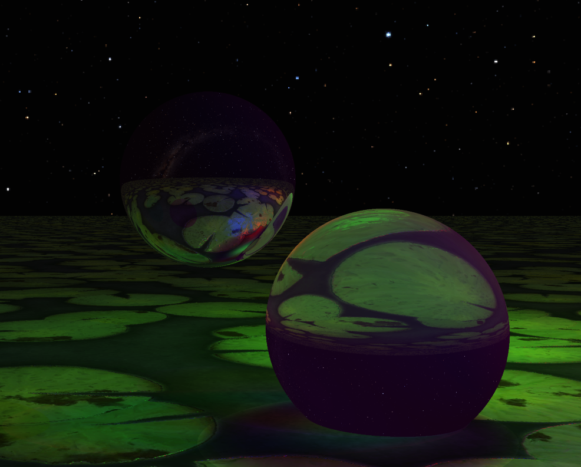
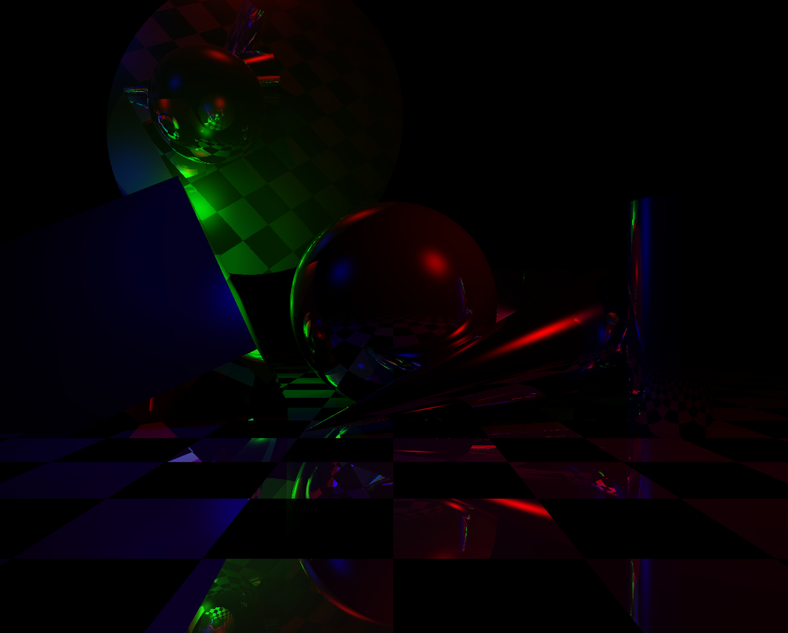
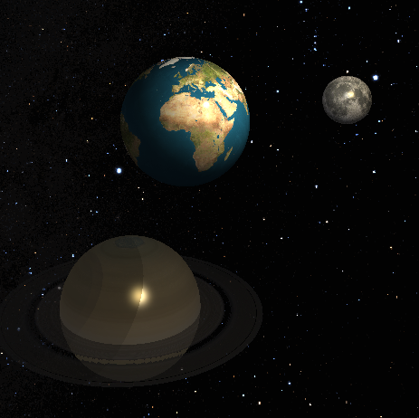
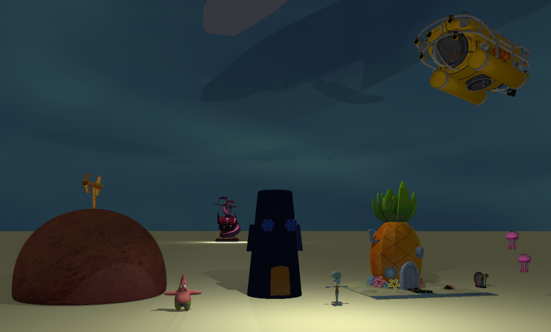
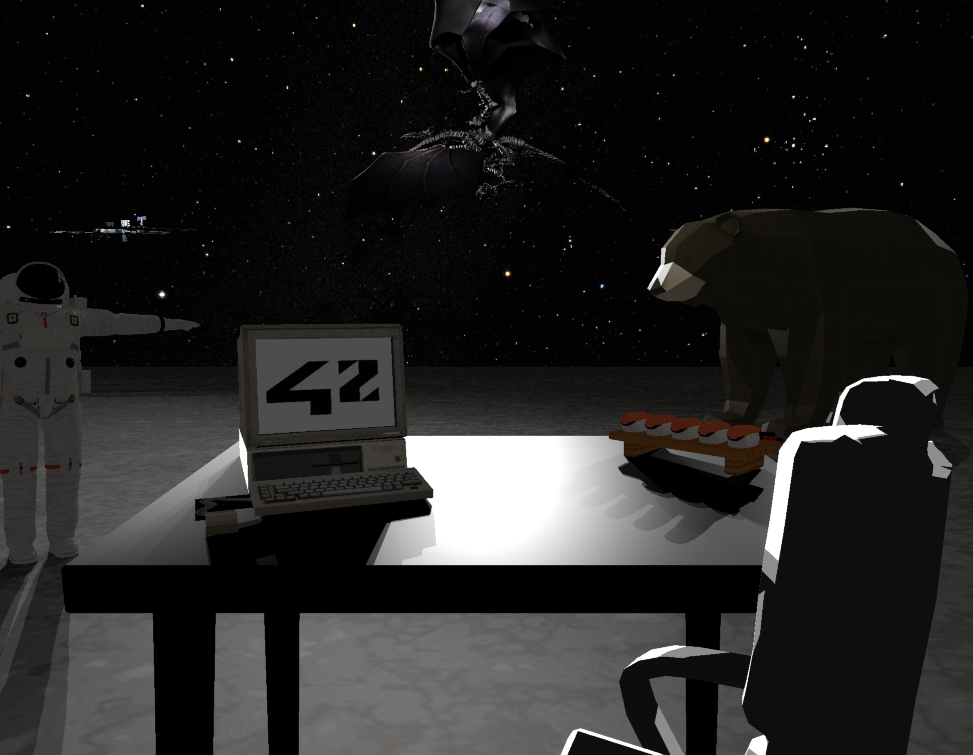
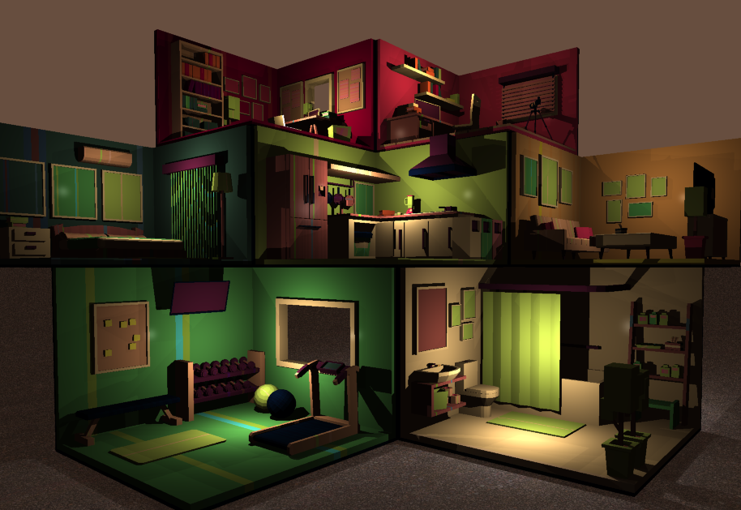
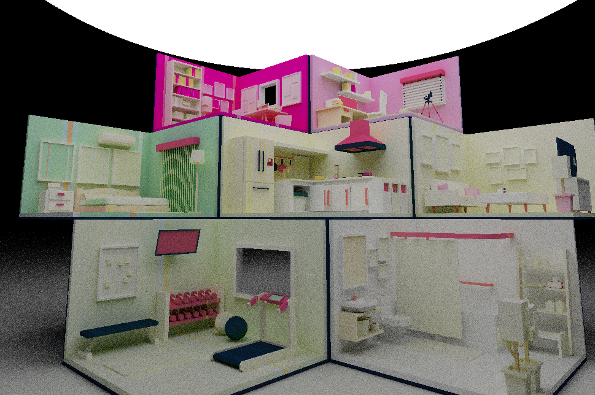

# MiniRT++

MiniRT++ is a raytracer capable of rendering 3D scenes described via a custom `.rt` scene description format.  
It supports classic geometric primitives, advanced implicit surfaces, mesh loading, and an extended physically-inspired material system including reflection, refraction, textures, and normal mapping.

# Gallery

## Transparence / Refraction


## Primitives Mirror scene


## Space scene


## Models.obj / textures.mtl



## House (normal lighting)


## House (progressive generation)

---

# Scene file format (.rt)

A `.rt` file describes the full 3D scene: cameras, lights, and objects.  
Each line starts with a type identifier followed by its parameters.

### General format

```bash
<element identifier> <mandatory values> <optional flags or features>
```

- `<identifier>`: type of element (C, A, L, sp, pl, cy, etc.)
- `<required values>`: mandatory geometric parameters (position, direction, color...)
- `<optional flags / addons>`: material properties, textures, and extensions (C, S, T, M, X, N, etc.)
- position and direction should be in the `f,f,f` format, ex: `0.2,1,5.55`
- Colors are RGB integers [0–255], ex: `255,42,0`

### Example (sphere)

```bash
# (sp) Sphere: POSITION (xyz)   DIAMETER   COLOR_rgb [0,255]
sp 0,0,0 10 255,0,0 S=0.6,150 M=0.3 X=txt/earth.xpm N=txt/earth_normal.xpm
```

---

## Global elements

### Camera
```bash
C position(x,y,z) direction(x,y,z) FOV
```

- `position`: camera origin
- `direction`: viewing direction vector
- `FOV`: field of view in degrees [0,180]

Multiple cameras may be defined. (and looped over at run time with `n`)

---

### Ambient light
```bash
A brightness color(r,g,b) [optional: texture]
```

- `brightness`: float [0.0–1.0]
- optional environment/texture map (e.g. skybox)

---

### Light source
```bash
L position(x,y,z) brightness color(r,g,b)
```
- Point light source
- `brightness`: [0.0–1.0]

---

## Primitive Objects

### Circle
```bash
ci: position direction color radius
```

### Sphere
```bash
sp: position diameter color
```

### Plane
```bash
pl: position normal color
```

### Cylinder
```bash
cy: position direction diameter height color
```

### Cone
```bash
co: position direction radius height color
```

### Hyperboloid
```bash
hy: position direction abc(x,y,z) radius² color
```

### Paraboloid
```bash
pa: position direction abc(x,y,z) radius color
```

### Arrow
```bash
ar: position direction radius height color
```

### Sprite (billboard)
```bash
xi: position direction size color texture.xpm
```

- Used to render for 2D pictures / sprites

## Mesh Objects
```bash
ob: position direction size color path/to/model.obj
```

- Supports any `.obj` mesh loading
- Supports `.mtl` if the `path/to/mtl` is correctly set in the .obj


# Material system

Objects may include optional material parameters:

C=... S=... T=... M=... X=... N=... A=... O=... s=... R=

---

### C — Secondary Base color

```bash
C=r,g,b
```

---

### S — Specular / shininess

```bash
S=strength,shininess
```

- strength: [0.0–1.0]
- shininess: ~10–500+


#### Material presets (reference)

- Wax → S=0.2,50  
- Plastic → S=0.4,100  
- Metal → S=0.8+,300+  
- Mirror → M=0.7–1.0  
- Glass → T=0.8,1.5  
- Rock → S=0.1,10  

---

### T — Transparency / refraction

```bash
T=transparency,ior
```

- transparency: [0–1]
- ior: index of refraction [1+](e.g. 1.33 water, 1.5 glass)

#### Material presets (reference)

- Water → T=1,1.33  
- Glass → S=0.95,1.5

---

### M — Mirror (reflection)

```bash
M=[0–1]
```

---
### L — Light emission (Emit the color of the material / texture)
```bash
L=[0–1]
```

---

## Texture maps

All textures must be in the .xpm format

### X — Diffuse texture

```bash
X=texture.xpm
```

### N — Normal map (Bump map)

```bash
N=normal.xpm
```

### A — Alpha (Partial transparence map)

```bash
A=alpha.xpm
```

### O — Ambient occlusion

```bash
O=ao.xpm
```

### s — Specular map

```bash
s=specular.xpm
```

### R — Roughness map

```bash
R=roughness.xpm
```

# Runtime Controls

## Movement
- Arrow keys → move camera
- Home / End → move up / down

---

## Rotation
- W A S D → rotate camera
- Q E → roll / additional rotation axis

---

## Mouse Controls
- Right click → select object
- Left click + drag → move camera
- Left click + drag (with object selected) → move camera around object
- Right click again → unselect object
- Mouse wheel → adjust movement speed

---

## Object Control
- All transformations apply to the currently selected object if one is selected, else to the camera

---

## Misc
- `H` → display help / advanced functions
- `N` → toggle cameras
- Scene file is reloaded in real time

## Advanced Functions (H menu)

Press number keys **0–9 (not numpad)**:

- **0** → Anti-aliasing toggle
- **1** → Loop selected object transparency
- **2** → Loop first light intensity
- **3** → Change color of selected object via input in `r,g,b` format
- **4** → Move selected object in the direction inputed `x,y,z` format, space to move / stop
- **5** → Toggle camera mode: Vector / Quaternion
- **6** → Render normal vector at clicked point
- **7** → Progressive rendering from objects generating light
- **8** → Visualize vector space of selected object
- **9** → Nothing

# Notes:
- automatically detect input file modification
- .obj rendering optimization via tree polygon finding
- scene size (and other values) can be adjusted in the CONSTANT part of `inc/minirt_const.h`